# Visual Studio Code Extension for Zowe

The Visual Studio Code (VSC) Extension for Zowe lets you interact with data sets that are stored on IBM z/OS mainframes. You can explore data sets, view their contents, make changes, and upload the changes to the mainframe. Interacting with data sets from VSC can be more convenient than using command-line interfaces or 3270 emulators.

 **Important!** To use the VSC Extension for Zowe, you must install Zowe CLI version **`2.0.0`** or later.

The VSC Extension for Zowe is powered by [Zowe CLI](https://zowe.org/home/). The extension demonstrates the potential for plug-ins powered by Zowe.

## Contents

* [Prerequisites](#prerequisites)
* [Configuration and usage tips](#configuration-and-usage-tips)
* [Sample use cases](#sample-use-cases)
* [USS](#uss)
* [Data Sets](#data-sets)
* [Jobs](#jobs)
* [Extras](#extras)

**Tip:** For information about how to install the extension from a `VSIX` file and run system tests on the extension, see the [Developer README](./docs/README.md) file that is located in the docs folder of this repository.

## Prerequisites

After you install the Zowe extension, meet the following prerequisites:

* [Install Zowe CLI](https://docs.zowe.org/stable/user-guide/cli-installcli.html#methods-to-install-zowe-cli) on your PC.
  
> **Important!**: To use the VSC Extension for Zowe, you must install Zowe CLI version `2.0.0` or later.

* [Create at least one Zowe CLI 'zosmf' profile](https://docs.zowe.org/stable/user-guide/cli-configuringcli.html#creating-zowe-cli-profiles).

## Configuration and usage tips

You can alter the behavior of the extension in the following ways:

* **Data set Safe Save:** The Visual Studio Code **Save** functionality will overwrite data set contents on the mainframe. To prevent conflicts, use the Zowe extension **Safe Save** functionality to compare changes made with initial mainframe contents before saving. For more information, see [Use Safe Save to prevent merge conflicts](#use-safe-save-to-prevent-merge-conflicts).
* **Data set persistence settings:** You can toggle the persistence of any data sets that are present under your **Favorites** tab.
  
**Tip:** By default, Visual Studio Code does not highlight data set syntax. To enhance the experience of using the extension, download an extension that highlights syntax, such as COBOL.

### Advanced Configuration

> **WARNING**: Specifying these preferences incorrectly, may cause the extension to fail.

Extension preferences can also be modified in the `Settings` for this extension. They can be customized in the following ways:

* **Data set creation settings:** You can change the default creation settings for various data set types.
* **Temp Folder Location:** You can change the default folder location, for where temporary files are stored. In order to set in `Settings`, use the example below.

```json
"Zowe-Temp-Folder-Location": {
    "folderPath": "/path/to/directory"
  }
```

## Sample use cases

Review the following use cases to understand how to use this extension.

### Add profile

You can add a profile for your data sets/jobs/uss files

1. Navigate to your explorer tree.
2. Click the **Search Data Sets** magnifying glass.
3. From the drop-down, either select the profile you want to add or search using the **Search Bar**

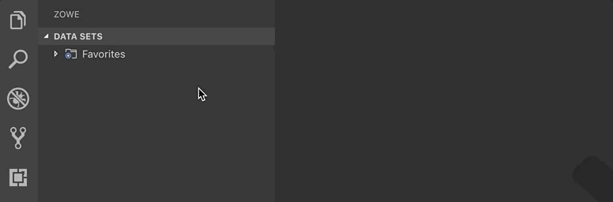
<br /><br />

### Refresh all

Refresh the list of data sets/jobs/uss files

1. Navigate to your explorer tree.
2. Click **Refresh All** button on the right of the **DATA SETS** explorer bar as illustrated by the following screen:

**Tip:** This technique can also be used for the USS and Jobs section


<br /><br />

### Integrated function

You can submit JCL files from data sets view and see the job spool output in jobs view


<br /><br />

# USS

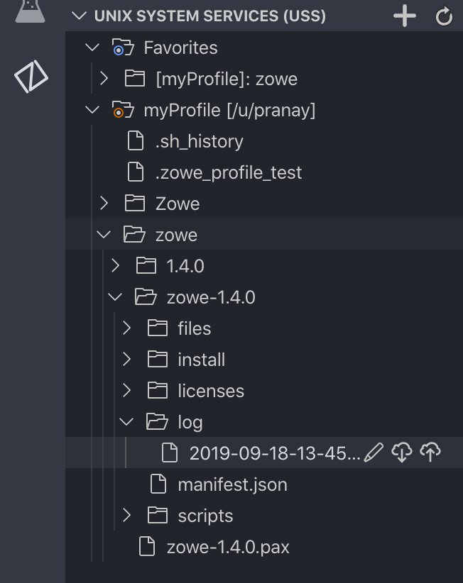
<br /><br />

## Menu Functions

### Create a new File or Directory

#### Create Directory

1. Navigate to your explorer tree.
2. Open the **Unix System Services (USS)** bar.
3. Select a directory that you want to add the new directory to.
4. Select the **Create directory** button and specify the directory name.
   The directory is created.


<br /><br />

#### Create File

1. Navigate to your explorer tree.
2. Open the **Unix System Services (USS)** bar.
3. Select a directory that you want to add the new file to.
4. Select the **Create file** button and specify the file name.
   The file is created.


<br /><br />

### Pull from the Mainframe

You can pull USS files from the mainframe

1. Navigate to your explorer tree.
2. Open the **USS** bar.
3. Open a profile.
4. Right click the file you want to pull.
5. Click the **Pull from Mainframe** button.

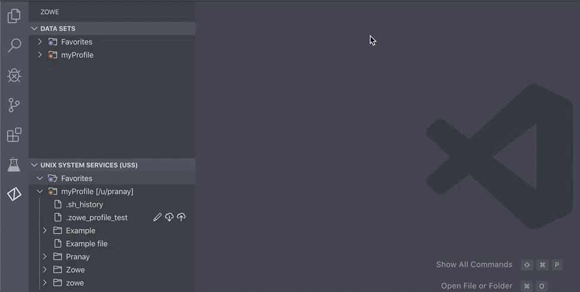
<br /><br />

### Safe Save

You can save your USS files and merge any confilcts it may have

1. Navigate to your explorer tree.
2. Open the **USS** bar.
3. Open a profile.
4. Download and edit a file.
5. Click the **Safe Save, merge if necessary** button for the file that you opened in the explorer tree.
6. Resolve merge conflicts if necessary.

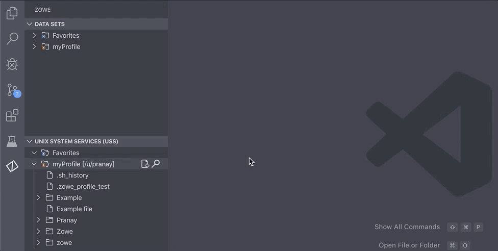
<br /><br />

### Toggle Binary

You can show the binary data of a file that changes the data transfer type to Image

1. Navigate to your explorer tree.
2. Open the **USS** bar.
3. Open a profile.
4. Right click the file you want to toggle the binary for.
5. Click the **Toggle Binary** button.


<br /><br />

### Add Favourite

Add your favourite USS file to make it more accessible

1. Right click the Directory/File you want to make a favourite.
2. Click the **Add Favourite** button to add the Directory/File to your Favourites list.

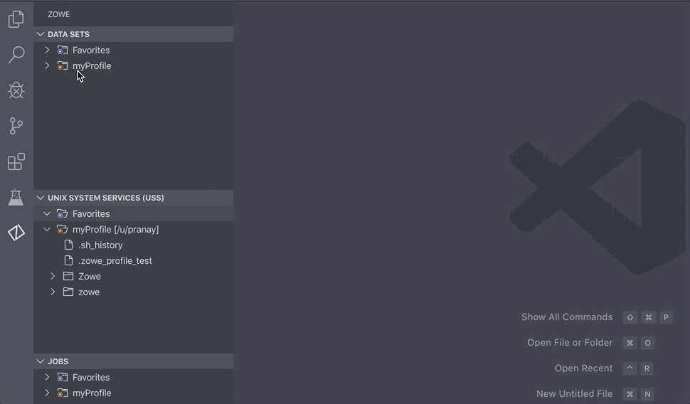
<br /><br />

### Rename

You can rename a directory/file

1. Right click the Directory/File you want to make a rename.
2. Click the **Rename** button to rename the Directory/File.
3. Rename the file and click enter to complete the renaming process.


<br /><br />

### Delete a File or Directory

#### Delete Directory

1. Navigate to your explorer tree.
2. Open the **Unix System Services (USS)** bar.
3. Select a directory you want to remove.
4. Select the **Delete** button and click yes in the confirmation dropdown.
   The directory and all child files and directories are deleted.


<br /><br />

#### Delete File

1. Navigate to your explorer tree.
2. Open the **Unix System Services (USS)** bar.
3. Select a file you want to remove.
4. Select the **Delete** button and click yes in the confirmation dropdown.
   The file is deleted.

### File opened with syntax highlighting

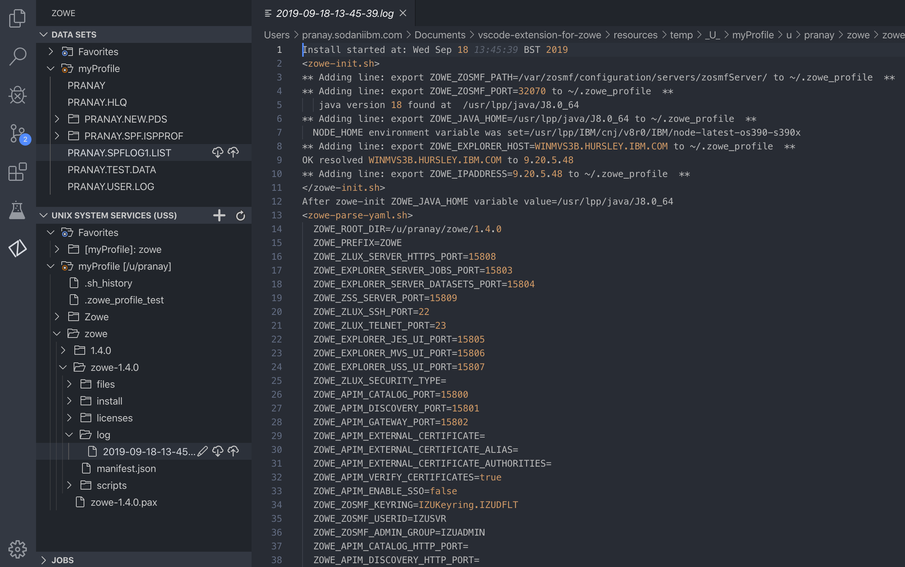
<br /><br />

## Searching

### Entering a root path

You can search multiple USS files by entering a path with commas in between

1. Navigate to your explorer tree.
2. Open the **USS** bar.
3. Select the profile that you want to filter.
4. Click the **Search USS system by entering a path** magnifying glass.
5. From the drop-down, click the **Specify Filter** button and enter the patterns that you want to filter.  
  The data sets that match your pattern(s) display in the explorer tree.


<br /><br />

### Selecting from history recall

You can search previous USS file paths easily

1. Navigate to your explorer tree.
2. Open the **USS** bar.
3. Select the profile that you want to filter.
4. Click the **Search USS system by entering a path** magnifying glass.
5. From the drop-down, select the Profile that you want.

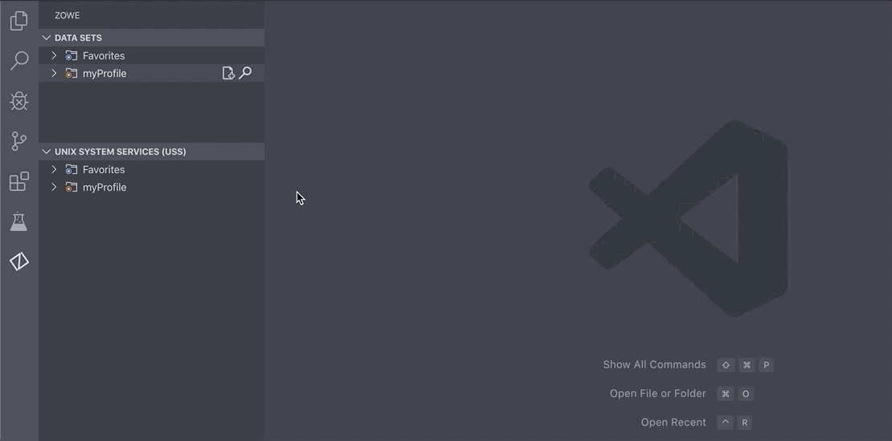
<br /><br />

# Data Sets

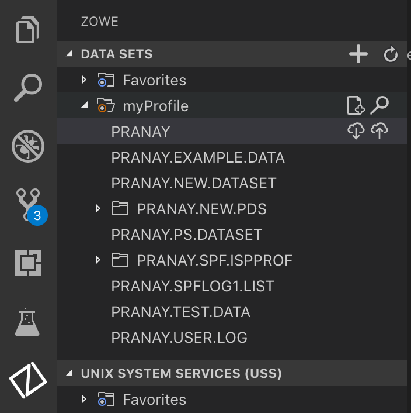
<br /><br />

## Menu functions

### Create Data Set

1. Navigate to your explorer tree.
2. Open the **DATA SETS** bar.
3. Select the **Create New Data Set** button to specify the profile that you want to use to create the data set.
4. From the drop-down menu, select the type of Data Set that you want to create.
5. Enter a name for the Data Set.
   The Data Set is created.

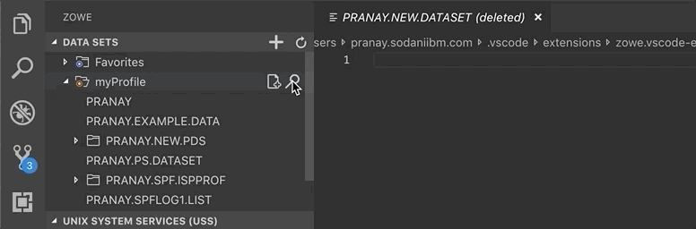
<br /><br />

### Create new member

1. To create a member, right-click the Data Set and select **Create New Member**.
2. Enter a name for the member.
   The member is created.


<br /><br />

### Upload new member

You can upload a data set member enabling you to transfer data between the host and the workstation

1. Click the Data Set member that you want to download.

    **Note:** To view the members of a Data Set, click the Data Set to expand the tree.

    The Data Set member displays in the text editor window of VSC.
2. Edit the document.
3. Navigate back to the Data Set member in the explorer tree, and click the **Safe Save** button.

Your Data Set member is uploaded.  

**Note:** If someone else has made changes to the Data Set member while you were editing it, you can merge your conflicts before uploading to the mainframe.


<br /><br />

### Show Data Set Attributes

You can see the different attributes of a data set such as the migration state

1. Right Click the Data Set member that you want to find out about more.
2. Click the **Show Data Set attributes** button.

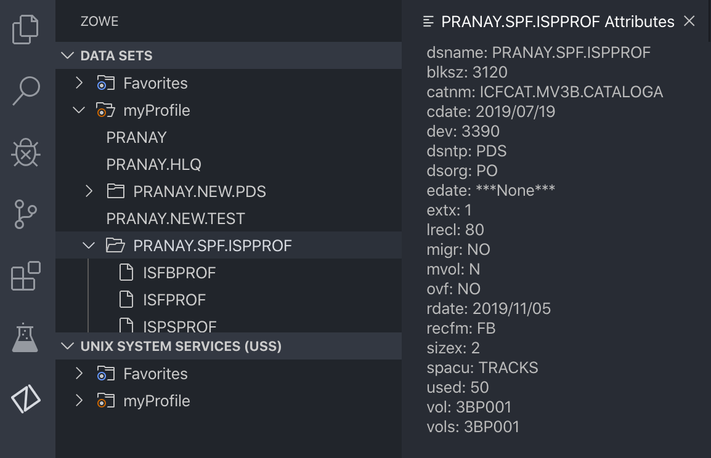
<br /><br />

### Delete Data Set

1. Navigate to your explorer tree.
2. Open the **DATA SETS** bar.
3. Open the profile and PDS containing the member.
4. Right-click on the PDS member that you want to delete and select **Delete Member**.
5. Confirm the deletion by clicking **Yes** on the drop-down menu.

    **Note:** Alternatively, you can select 'No' to cancel the deletion.
6. To delete a PDS, right-click the PDS and click **Delete PDS**, then confirm the deletion.

    **Note:** You can delete a PDS before you delete its members.

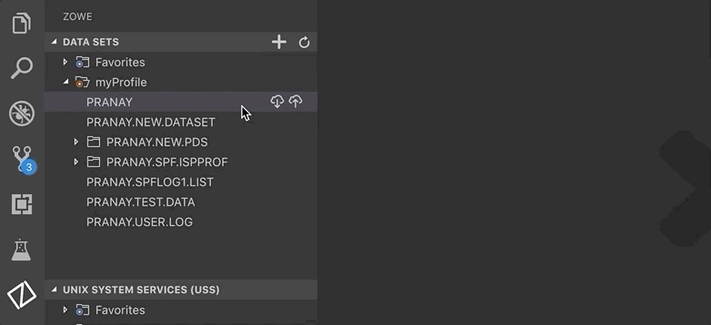
<br /><br />

### File opened with syntax highlighting

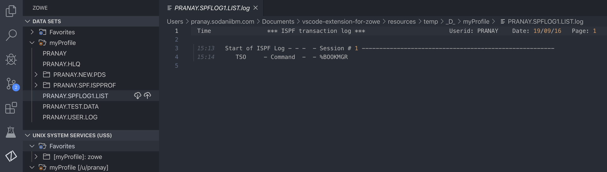
<br /><br />

## Searching

### Entering a root path

You can search multiple data sets by entering a path with commas in between

1. Navigate to your explorer tree.
2. Open the **DATA SETS** bar.
3. Select the profile that you want to filter.
4. Click the **Search Data Sets by Entering Patterns** magnifying glass.
5. From the drop-down, click the **Specify Filter** button and enter the patterns that you want to filter.
  The data sets that match your pattern(s) display in the explorer tree.

**Tip:** To provide multiple filters, separate entries with a comma. You can prepend or append any filter with an \*, which indicates wildcard searching. You cannot enter an \* as the entire pattern.


<br /><br />

### Selecting from history recall

You can search previous data set paths easily

1. Navigate to your explorer tree.
2. Open the **DATA SETS** bar.
3. Select the profile that you want to filter.
4. Click the **Search Data Sets by Entering Patterns** magnifying glass.
5. From the drop-down, select the Data set that you want.

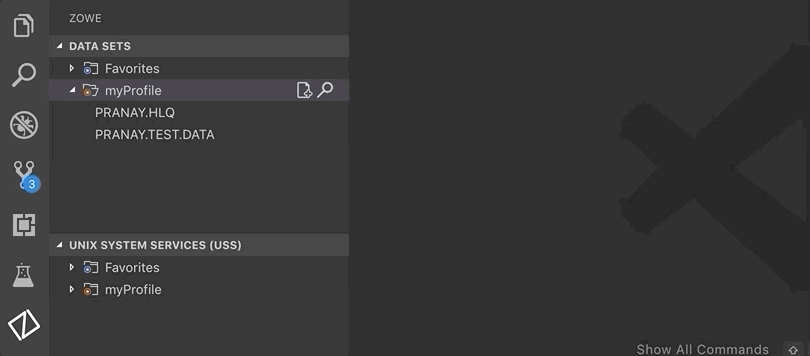
<br /><br />

## Favourites

### Adding favourites

Add your favourite data sets to make then more accessible

1. Right click the Data Set you want to make a favourite
2. Click the **Add Favourite** button to add the Data Set to your Favourites list

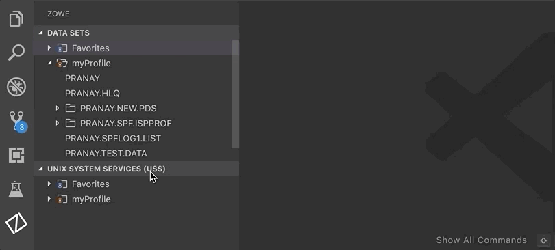
<br /><br />

# Jobs

## Menu Functions

### Get JCL of a File

1. Right cick the Job you want the JCL of.
2. Click the **Get JCL** button.


<br /><br />

### Issue Modify Command

Use the modify command to pass information to a job or started task

1. Right cick the Job you want to issue the modify command on.
2. Click the **Issue Modify Command** button.


<br /><br />

### Issue Stop Command

Use the Stop command to stop system functions and jobs in execution

1. Right cick the Job you want to issue the modify command on.
2. Click the **Issue Stop Command** button.


<br /><br />

### Delete Job

1. Hover your mouse over the job you want to delete
2. Click the **Delete** trash can button.

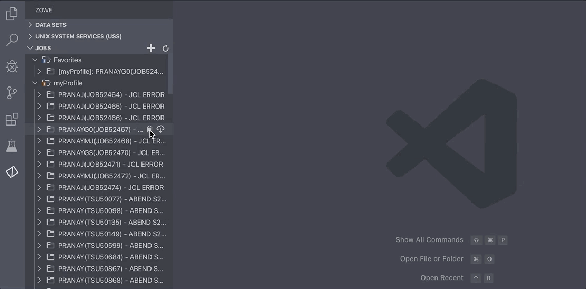
<br /><br />

### Download Spool

You can use this operation to retrieve the contents of a job spool file

1. Navigate to your explorer tree.
2. Open the **Jobs** bar.
3. Open a profile.
4. Click the **Download Spool** button for the Job you want.


<br /><br />

## Favourites

### Adding favourites

Add your favourite jobs to make then more accessible

1. Right click the Job you want to make a favourite
2. Click the **Add Favourite** button to add the Job to your Favourites list


<br /><br />

# Extras

### Issue TSO Command

You can issue TSO commands such as Allocate or Exec against a profile.

1. Use _Cmnd+Shift+P_
2. Click the **Zowe:Issue TSO Command** button
3. Select the profile you want to issue the command on
4. Type in your command


<br /><br />
