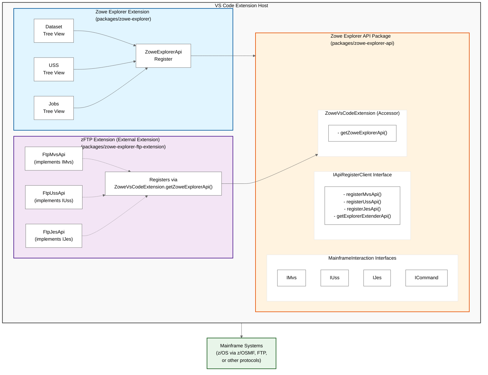
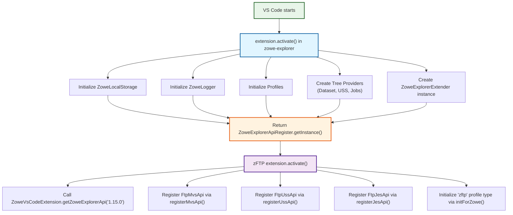
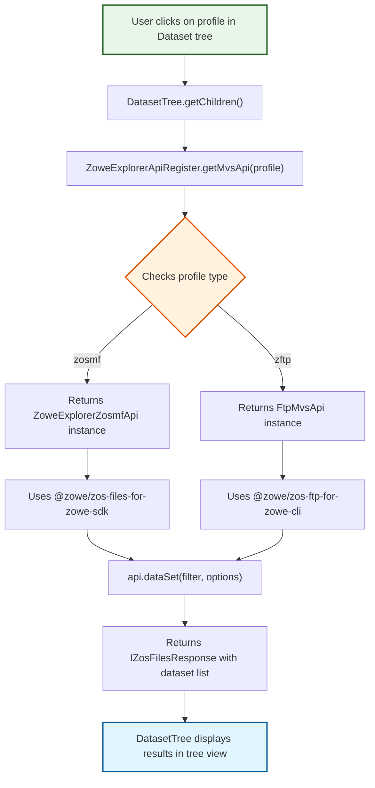
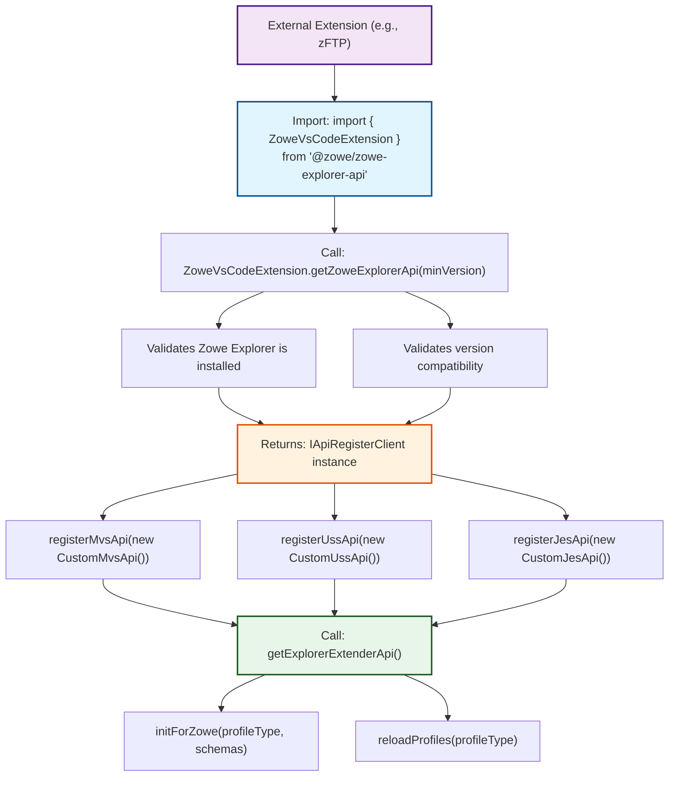
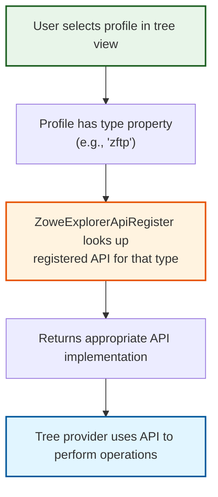

# Zowe Explorer Architecture Map

## Overview

This document provides a comprehensive architecture map of the Zowe Explorer VS Code extension ecosystem, detailing how the main extension connects to the Zowe Explorer API and extensibility framework, and how external extensions like the zFTP extension integrate with the system.

## Repository Structure

The Zowe Explorer project is organized as a monorepo with three main packages:

```
zowe-explorer-vscode/
├── packages/
│   ├── zowe-explorer/              # Main VS Code extension
│   ├── zowe-explorer-api/          # API and extensibility framework
│   └── zowe-explorer-ftp-extension/ # FTP protocol extension
```

---

## High-Level Architecture



---

## Component Details

### 1. Zowe Explorer Extension (`packages/zowe-explorer`)

**Purpose**: Main VS Code extension providing tree views and user interface for interacting with z/OS systems.

**Key Components**:

#### Entry Point

- **[`extension.ts`](packages/zowe-explorer/src/extension.ts)**: Main activation function
  - Initializes local storage and logging
  - Creates profile management
  - Initializes tree providers (Dataset, USS, Jobs)
  - Returns `ZoweExplorerApiRegister` instance for extensibility

#### Tree Providers

- **[`DatasetTree`](packages/zowe-explorer/src/trees/dataset/DatasetTree.ts)**: Manages dataset tree view
- **[`USSTree`](packages/zowe-explorer/src/trees/uss/USSTree.ts)**: Manages USS file system tree view
- **[`JobTree`](packages/zowe-explorer/src/trees/job/JobTree.ts)**: Manages jobs tree view

#### Extensibility Layer

- **[`ZoweExplorerApiRegister`](packages/zowe-explorer/src/extending/ZoweExplorerApiRegister.ts)**:

  - Singleton registry for API implementations
  - Provides static methods to get API instances by profile
  - Implements `IApiRegisterClient` interface
  - Manages API lookups for MVS, USS, JES, and Command operations

- **[`ZoweExplorerExtender`](packages/zowe-explorer/src/extending/ZoweExplorerExtender.ts)**:
  - Implements `IApiExplorerExtender` interface
  - Provides profile management and initialization for external extensions
  - Handles Zowe configuration errors and validation

#### File System Providers

- **[`DatasetFSProvider`](packages/zowe-explorer/src/trees/dataset/DatasetFSProvider.ts)**: Virtual file system for datasets
- **[`UssFSProvider`](packages/zowe-explorer/src/trees/uss/UssFSProvider.ts)**: Virtual file system for USS files
- **[`JobFSProvider`](packages/zowe-explorer/src/trees/job/JobFSProvider.ts)**: Virtual file system for job outputs

---

### 2. Zowe Explorer API (`packages/zowe-explorer-api`)

**Purpose**: Provides interfaces, types, and base implementations for extending Zowe Explorer functionality.

**Key Components**:

#### Core Interfaces

- **[`MainframeInteraction`](packages/zowe-explorer-api/src/extend/MainframeInteraction.ts)**: Defines interfaces for mainframe operations
  - `ICommon`: Base interface for all API types
  - `IMvs`: Dataset operations (list, read, write, delete, etc.)
  - `IUss`: USS file operations (list, read, write, delete, etc.)
  - `IJes`: Job operations (submit, list, download spool files, etc.)
  - `ICommand`: Console command operations

#### Extensibility Interfaces

- **[`IApiRegisterClient`](packages/zowe-explorer-api/src/extend/IRegisterClient.ts)**:

  - Interface for registering API implementations
  - Methods: `registerMvsApi()`, `registerUssApi()`, `registerJesApi()`, `registerCommandApi()`
  - Provides access to `IApiExplorerExtender`

- **[`IApiExplorerExtender`](packages/zowe-explorer-api/src/extend/IApiExplorerExtender.ts)**:
  - Interface for extension initialization
  - Methods: `initForZowe()`, `reloadProfiles()`
  - Allows extensions to register profile types and schemas

#### Access Point

- **[`ZoweVsCodeExtension`](packages/zowe-explorer-api/src/vscode/ZoweVsCodeExtension.ts)**:
  - Static accessor class for external extensions
  - `getZoweExplorerApi(version)`: Returns the API register instance
  - Validates minimum version requirements

#### File System Types

- **[`BaseProvider`](packages/zowe-explorer-api/src/fs/BaseProvider.ts)**: Base class for file system providers
- **Dataset, USS, and Jobs types**: Type definitions for file system operations

#### Profile Management

- **[`ProfilesCache`](packages/zowe-explorer-api/src/profiles/ProfilesCache.ts)**: Manages Zowe CLI profiles
- **[`ZoweExplorerZosmfApi`](packages/zowe-explorer-api/src/profiles/ZoweExplorerZosmfApi.ts)**: Default z/OSMF API implementation

---

### 3. zFTP Extension (`packages/zowe-explorer-ftp-extension`)

**Purpose**: Provides FTP protocol support as an alternative to z/OSMF for connecting to z/OS systems.

**Key Components**:

#### Entry Point

- **[`extension.ts`](packages/zowe-explorer-ftp-extension/src/extension.ts)**:
  - Activates and registers FTP API implementations
  - Uses `ZoweVsCodeExtension.getZoweExplorerApi()` to access the main extension
  - Registers FTP APIs: `FtpMvsApi`, `FtpUssApi`, `FtpJesApi`
  - Initializes profile schema for "zftp" profile type

#### API Implementations

- **[`AbstractFtpApi`](packages/zowe-explorer-ftp-extension/src/ZoweExplorerAbstractFtpApi.ts)**:

  - Base class implementing `ICommon` interface
  - Manages FTP session connections
  - Provides profile type name: "zftp"

- **[`FtpMvsApi`](packages/zowe-explorer-ftp-extension/src/ZoweExplorerFtpMvsApi.ts)**:

  - Implements `IMvs` interface
  - Provides dataset operations via FTP protocol
  - Uses `@zowe/zos-ftp-for-zowe-cli` package

- **[`FtpUssApi`](packages/zowe-explorer-ftp-extension/src/ZoweExplorerFtpUssApi.ts)**:

  - Implements `IUss` interface
  - Provides USS file operations via FTP protocol

- **[`FtpJesApi`](packages/zowe-explorer-ftp-extension/src/ZoweExplorerFtpJesApi.ts)**:
  - Implements `IJes` interface
  - Provides job operations via FTP protocol

#### Session Management

- **[`FtpSession`](packages/zowe-explorer-ftp-extension/src/ftpSession.ts)**:
  - Manages FTP connection lifecycle
  - Maintains separate connections for MVS, USS, and JES operations
  - Stored in global `SESSION_MAP` for reuse

---

## Data Flow

### 1. Extension Activation Flow



### 2. API Call Flow (Example: List Datasets)



### 3. Extension Registration Flow



---

## Key Design Patterns

### 1. **Singleton Pattern**

- `ZoweExplorerApiRegister`: Single instance manages all API registrations
- `ZoweExplorerExtender`: Single instance manages extension functionality

### 2. **Registry Pattern**

- API implementations are registered by profile type
- Lookup by profile returns the appropriate API implementation
- Supports multiple implementations for the same interface (z/OSMF, FTP, custom)

### 3. **Strategy Pattern**

- Different API implementations (`IMvs`, `IUss`, `IJes`) can be swapped based on profile type
- Tree providers use APIs through interfaces, not concrete implementations

### 4. **Factory Pattern**

- `ZoweExplorerApiRegister` acts as a factory for API instances
- Static methods like `getMvsApi()`, `getUssApi()`, `getJesApi()` create/retrieve instances

### 5. **Extension Point Pattern**

- Well-defined interfaces (`IApiRegisterClient`, `IApiExplorerExtender`) for extensibility
- External extensions can register implementations without modifying core code

---

## Extension Points

### For External Extensions

1. **Access the API**:

   ```typescript
   import { ZoweVsCodeExtension } from "@zowe/zowe-explorer-api";
   const api = ZoweVsCodeExtension.getZoweExplorerApi("1.15.0");
   ```

2. **Register API Implementations**:

   ```typescript
   api.registerMvsApi(new CustomMvsApi());
   api.registerUssApi(new CustomUssApi());
   api.registerJesApi(new CustomJesApi());
   ```

3. **Initialize Profile Type**:
   ```typescript
   const extenderApi = api.getExplorerExtenderApi();
   await extenderApi.initForZowe(profileType, schemas);
   await extenderApi.reloadProfiles(profileType);
   ```

### Interfaces to Implement

- **`MainframeInteraction.IMvs`**: Dataset operations
- **`MainframeInteraction.IUss`**: USS file operations
- **`MainframeInteraction.IJes`**: Job operations
- **`MainframeInteraction.ICommand`**: Console command operations
- **`MainframeInteraction.ICommon`**: Base interface with common methods

---

## Profile Management

### Profile Types

1. **zosmf**: Default profile type using z/OSMF REST API
2. **zftp**: FTP profile type provided by zFTP extension
3. **Custom**: Extensions can register additional profile types

### Profile Resolution



---

## Communication Patterns

### 1. **Synchronous API Calls**

- Tree providers call API methods directly
- APIs return promises that resolve with results

### 2. **Event-Based Communication**

- `onProfileUpdated`: Emitted when profiles change
- File system providers emit change events for file updates

### 3. **VS Code Extension API**

- Tree views register with VS Code
- Commands registered via `vscode.commands.registerCommand()`
- File systems registered via `vscode.workspace.registerFileSystemProvider()`

---

## Dependencies

### Zowe Explorer → Zowe Explorer API

- Direct dependency
- Imports interfaces, types, and base classes
- Uses API register for extensibility

### zFTP Extension → Zowe Explorer API

- Direct dependency
- Imports interfaces to implement
- Uses `ZoweVsCodeExtension` to access main extension

### zFTP Extension → Zowe Explorer

- Indirect dependency via API
- No direct imports from main extension
- Communicates through API interfaces only

### External Dependencies

- **@zowe/imperative**: Zowe CLI framework
- **@zowe/zos-files-for-zowe-sdk**: z/OSMF dataset/USS operations
- **@zowe/zos-jobs-for-zowe-sdk**: z/OSMF job operations
- **@zowe/zos-ftp-for-zowe-cli**: FTP protocol operations

---

## Security Considerations

1. **Credential Management**:

   - Profiles stored in Zowe CLI configuration
   - Credentials can be stored in secure credential manager
   - `KeytarCredentialManager` for secure storage

2. **Session Management**:

   - FTP sessions cached and reused
   - Sessions released on extension deactivation
   - Connection pooling for efficiency

3. **Profile Validation**:
   - Profiles validated before use
   - Schema validation for profile types
   - Error handling for invalid configurations

---

## Future Extensibility

The architecture supports:

1. **Additional Protocol Support**: New extensions can add support for other protocols (SSH, REST, etc.)
2. **Custom Tree Providers**: Extensions can add new tree views
3. **Custom Commands**: Extensions can register additional commands
4. **Custom File Systems**: Extensions can provide alternative file system implementations
5. **Custom Webviews**: Extensions can add custom UI panels

---

## Summary

The Zowe Explorer architecture is designed for extensibility and modularity:

- **Core Extension** provides UI and tree views
- **API Package** defines interfaces and contracts
- **External Extensions** implement interfaces for different protocols
- **Registry Pattern** allows dynamic API selection based on profile type
- **Clean Separation** between UI, business logic, and protocol implementations

This design allows the Zowe Explorer ecosystem to grow with new capabilities without modifying the core extension, making it a robust platform for mainframe development tools in VS Code.
