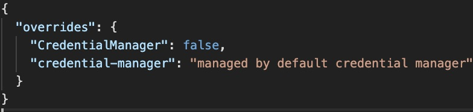

# Integrating Secure Credentials within Zowe Explorer

The support for secure credentials has recently been enhanced to support backwards compatibility with previous versions of the Secure Credentials Store Plugin (SCS) Users of Zowe Explorer are able to exploit this functionality in particular way

## Zowe CLI is already installed

Zowe Explorer users who already have Zowe CLI installed or indeed already have a version of the SCS plugin installed are now able to seamlessly take advantage of profiles defined within their Zowe CLI environment and use them within Zowe Explorer with credentials safely hidden in the credentials store appropriate to the operating systems. Zowe Explorer will automatically identify the profiles and what's more allow you to create new profiles from within Zowe Explorer that can be used by Zowe CLI.
More details about installing and configuring the SCS plugin are available./..   Including a description on how to migrate existing profiles to the new format.

## Zowe Explorer is installed "Standalone"

Although our recommendation is for users to use the latest SCS plugin, this is not an option for Zowe Explorer users without CLI installed locally. In this situation users can still use credentials that are integrated with operating systems credentials store using a in-built mechanism. To enable this two manual updates are required.

**Step 1. Update the ~/.zowe/settings/imperative.json file**
- Located in the user root folder is the ./zowe folder containing configuration information for CLI and the Zowe Explorer. Navigate down to the ./settings folder and edit the imperative.json files as follows:

- Add the following new key: "credential-manager": "managed by default credential manager"

- Save the file

**Step 2. Set the relevant setting in VSCode.**

- Open the Command Palette and select Preferences: Open settings (UI)

- Click on extensions and select Zowe Explorer (at the very bottom of the list)

- Confirm that the Zowe Security: Credential Key is set to @zowe/cli

- Restart VSCode to pick up your changes.

There is currently no mechanism with which you can update exiting profiles and it is necessary to remove all existing profiles before restarting VSCode. Once you have done this please restart VSCode and use the add profile options to create new profiles.