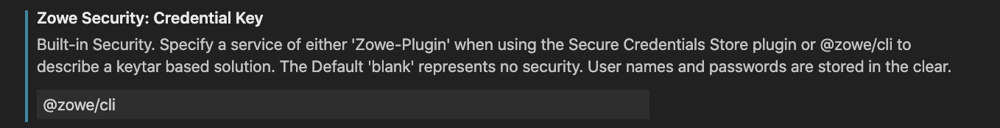

# Integrating Secure Credentials within Zowe Explorer

The support for secure credentials has recently been enhanced to support backwards compatibility with previous versions of the Secure Credentials Store Plugin (SCS). Users of Zowe Explorer are able to exploit this functionality in a manner specific to their type of installation.

## Zowe CLI is already installed

Zowe Explorer users who already have Zowe CLI installed or in addition have a version of the SCS plugin installed can now seamlessly take advantage of the profiles defined in Zowe CLI and use them within Zowe Explorer with secure credentials.
Secure credentials are stored in a keystore appropriate for the operating system they are running under. Zowe Explorer automatically identifies these profiles and what's more allows you to create new profiles that are also available to the Zowe CLI.

the Secure Credentials Store Plugin (SCS) is simply installed into the Zowe CLI using the command **zowe plugins install @zowe/secure-credential-store-for-zowe-cli.** For more details click [@zowe/secure-credential-store-for-zowe-cli](https://www.npmjs.com/package/@zowe/secure-credential-store-for-zowe-cli)

**Using the Secure Credential Store Plug-in for Zowe**

The plug-in introduces a new command group, `zowe scs`, that lets you update existing user profiles and enable or disable the plug-in.

Securing your credentials

After you install the plug-in, any user profiles that you create will automatically store your credentials securely.
To secure credentials in existing user profiles (profiles that you created prior to installing the SCS plug-in), issue the following command:

    `zowe scs update`

## Zowe Explorer is installed "Standalone"

Although our recommendation is for users to use the latest SCS plugin, this is not an option for Zowe Explorer users who operate without CLI installed locally. In this situation users can still use credentials that are integrated with operating systems credentials store using a in-built mechanism. To enable this two manual updates are required.

**Step 1. Create the ~/.zowe/settings/imperative.json file**

- Located in the user root folder is the `.zowe` folder containing configuration information for CLI and the Zowe Explorer. Create a `settings` folder inside, if it does not exist.

- In the `settings` folder, create a file `imperative.json`, and edit it as follows.

- Add the following new key: `"CredentialManager": "Zowe Explorer"`

```json
{
  "overrides": {
    "CredentialManager": "Zowe Explorer"
  }
}
```

- Save the file.

**Step 2. Set the relevant setting in VSCode**

- Open the Command Palette and select "Preferences: Open settings (UI)".

- Click on extensions and select Zowe Explorer (at the very bottom of the list).

- Confirm that the "Zowe Security: Credential Key is set to "Zowe-Plugin".



- Restart VSCode to pick up your changes.

There is currently no mechanism with which you can update exiting profiles and it is necessary to remove all existing profiles before restarting VSCode. Once you have done this please restart VSCode and use the add profile options to create new profiles.