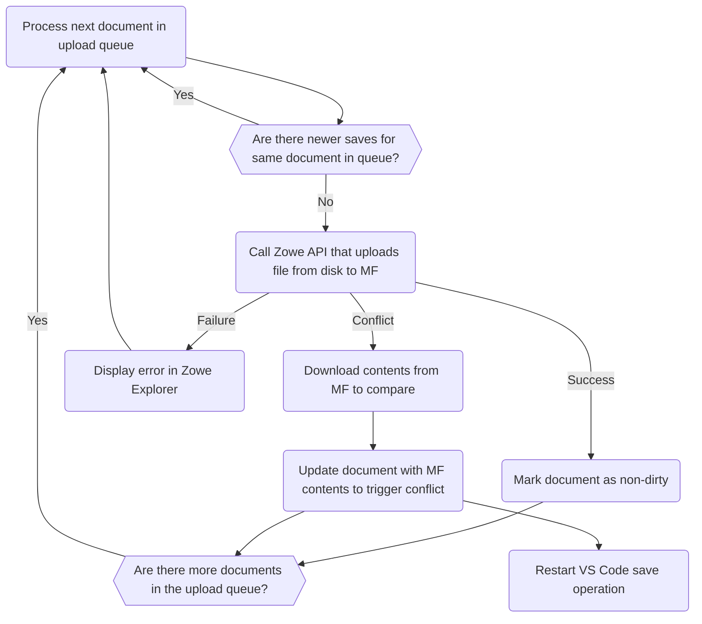
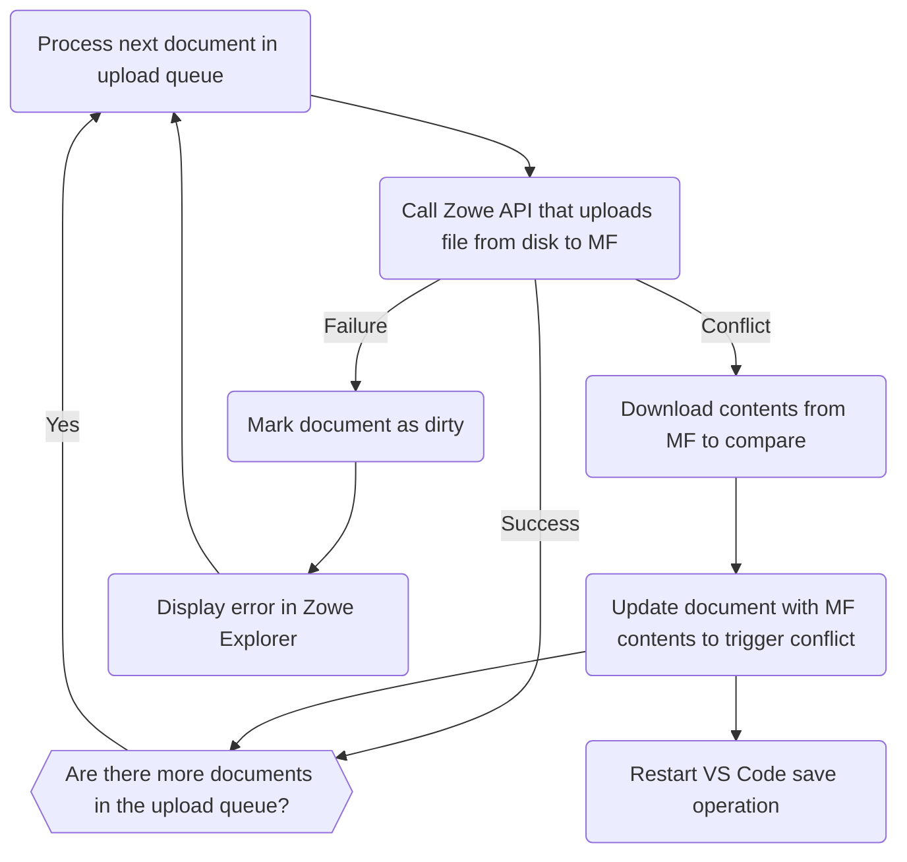

## New

```mermaid
flowchart TD
    begin(VSCode begins save operation)
    begin-->format

    format(VSCode formatter extensions apply changes to the document)
    format-->isConflict

    didSave{{"`onDidSaveTextDocument` event (No threshold)"}}
    didSave-->enqueueUpload

    isConflict(VS Code: Is there a conflict with the current save operation and a new save operation?)
    isConflict-->|Yes| promptConflictResolution
    isConflict-->|No| saveToDisk

    promptConflictResolution{{Compare or overwrite changes?}}
    promptConflictResolution-->|Compare| vscodeDiff
    promptConflictResolution-->|Overwrite| begin

    vscodeDiff(Show diff between old and new versions of file)
    vscodeDiff-->userResolvesConflicts

    userResolvesConflicts(User chooses desired version of file to upload)
    userResolvesConflicts-->begin

    saveToDisk(VS code saves file to disk)
    saveToDisk-->markAsSaved

    markAsSaved(VS Code marks document as saved)
    markAsSaved-->didSave

    enqueueUpload(Mark document as dirty and add to upload queue)
    enqueueUpload-->filesInQueue

    filesInQueue{{Is a document currently being uploaded?}}
    filesInQueue -->|Yes| exit(Exit)
    filesInQueue -->|No| gotoQueue(Process upload queue)
```



---

## Legacy

```mermaid
flowchart TD
    begin(VSCode begins save operation)
    begin-->format

    format(VSCode formatter extensions apply changes to the document)
    format-->willSave

    willSave{{"`onWillSaveTextDocument` event (1.5s threshold)"}}
    willSave-->|VS Code| isConflict
    willSave-->|Zowe Explorer| enqueueUpload

    isConflict(Is there a conflict with the current save operation and a new save operation?)
    isConflict-->|Yes| promptConflictResolution
    isConflict-->|No| saveToDisk

    promptConflictResolution{{Compare or overwrite changes?}}
    promptConflictResolution-->|Compare| vscodeDiff
    promptConflictResolution-->|Overwrite| begin

    vscodeDiff(Show diff between old and new versions of file)
    vscodeDiff-->userResolvesConflicts

    userResolvesConflicts(User chooses desired version of file to upload)
    userResolvesConflicts-->begin

    saveToDisk(VS code saves file to disk)
    saveToDisk-->markAsSaved

    markAsSaved(VS Code marks document as saved)

    enqueueUpload(Add document to upload queue)
    enqueueUpload-->filesInQueue

    filesInQueue{{Is a document currently being uploaded?}}
    filesInQueue -->|Yes| exit(Exit)
    filesInQueue -->|No| gotoQueue(Process upload queue)
```



---

TODO: [v3] Revise flowcharts to use `vscode.FileSystemProvider`
