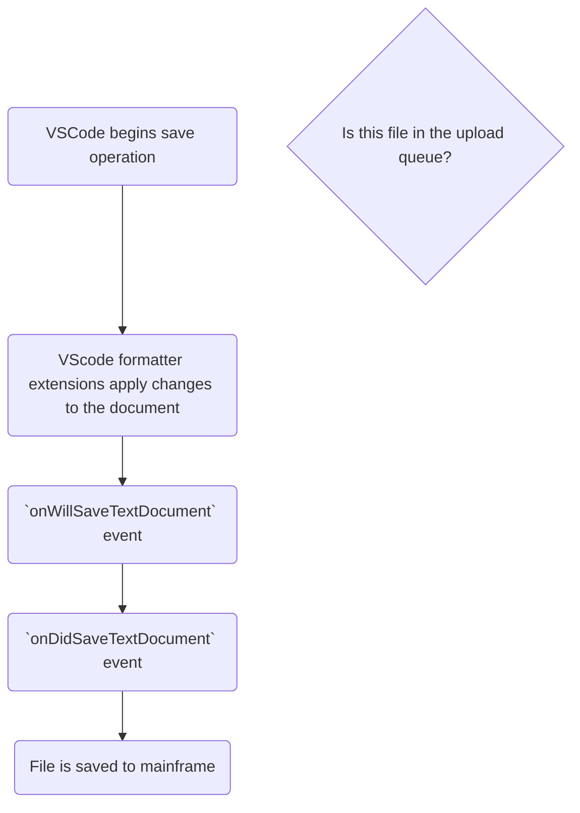

```mermaid
flowchart TD
    begin(VSCode begins save operation)
    format(VSCode formatter extensions apply changes to the document)

    willSave("`onWillSaveTextDocument` event (1.5s threshold)")
    enqueueUpload(Add document to upload queue)
    filesInQueue{{Is a document currently being uploaded?}}
    awaitMfRequest(Await mainframe response for uploading file)
    awaitMfRequest -->|Success| checkQueue
    awaitMfRequest -->|Conflict| downloadRemoteDs
    awaitMfRequest -->|Failure| throwError
    checkQueue{{Are there more documents in the upload queue?}}

    promptConflictResolution{{Compare or overwrite changes?}}
    downloadRemoteDs(Download contents from MF to compare)
    downloadRemoteDs-->promptConflictResolution
    promptConflictResolution -->|Compare| showCompare(Show diff between local and remote file)

    resolveConflicts(User picks desired version )

    showCompare-->resolveConflicts
    resolveConflicts-->begin
    promptConflictResolution -->|Overwrite| checkIfExists

    filesInQueue -->|Yes| returnEarly[Add to upload queue]
    filesInQueue -->|No| startQueue[Start processing next document in upload queue]

    startQueue-->checkDsType
    checkDsType{{Check data set type}}
    checkDsType -->|Partitioned| continueUpload
    checkDsType -->|Sequential| checkIfExists
    checkIfExists{{Does it exist on the MF?}}
    continueUpload(Continue to upload)

    downloadRemoteDs-->checkQueue
    checkIfExists -->|Yes| continueUpload(Continue to upload)
    checkIfExists -->|No| throwError(Display error in Zowe Explorer)
    throwError-->checkQueue

    continueUpload-->awaitMfRequest

    checkQueue -->|Yes| startQueue

    finish(File is saved to mainframe)

    begin-->format
    format-->willSave
    willSave-->enqueueUpload
    enqueueUpload-->filesInQueue
```


