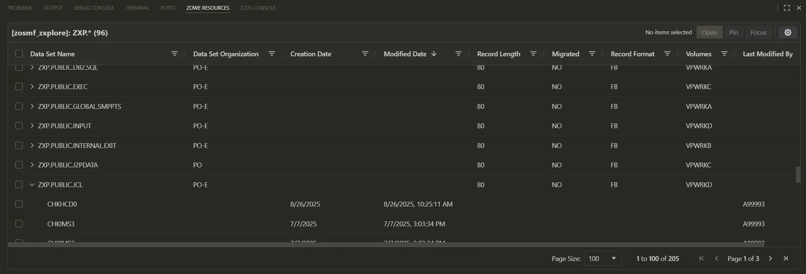
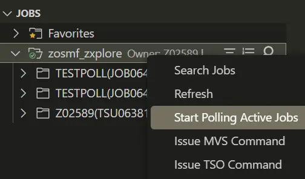
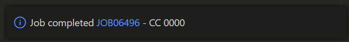
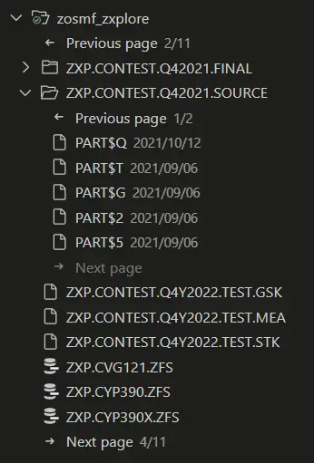
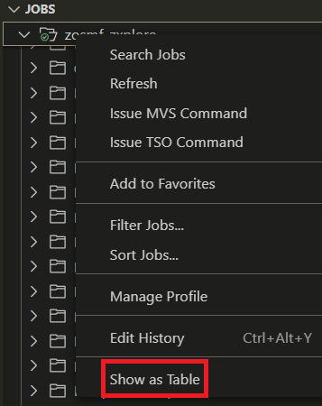
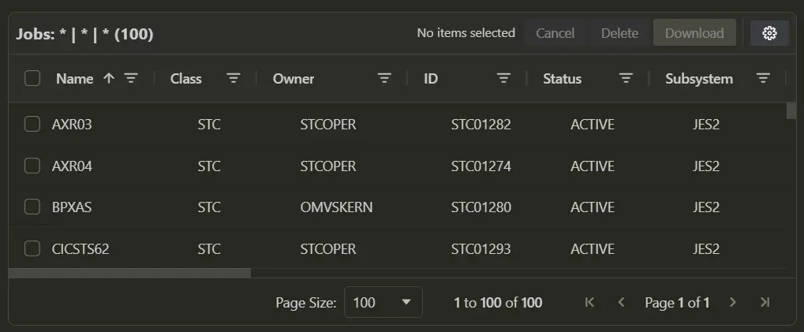
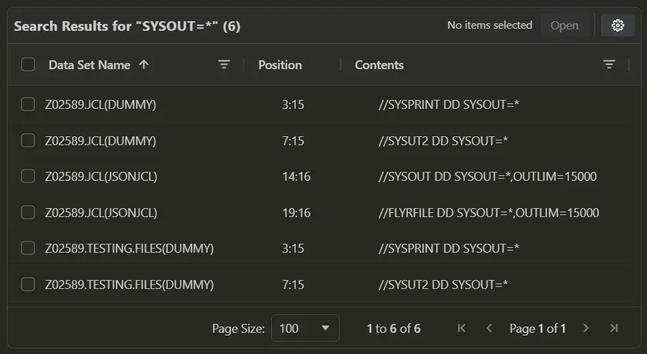
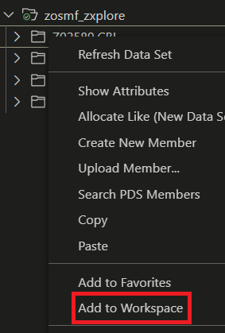
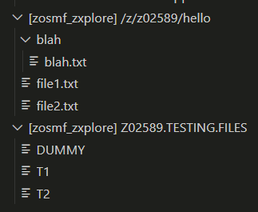

## `3.4.0`

### VS Code engine support change

Updated minimum VS Code version from 1.79 to 1.90. We are dropping support for VS Code releases that bundle versions of Node.js no longer receiving security updates.

### Credential Manager Updates

#### Loading credential manager options

Added support for loading credential manager options from the imperative.json file. Added a `credentialManagerOptions` object in the JSON object in `imperative.json` to specify options for the current credential manager.

#### Windows custom persistence levels

Added support for custom persistence levels for Windows (persist option) to support the credential manager in less permissive environments. For more information on how to configure this option, refer to the ["Troubleshooting Zowe CLI credentials"](https://docs.zowe.org/stable/troubleshoot/cli/troubleshoot-cli-credentials/#secrets-sdk-persistence-level-for-windows) page on Zowe Docs.

### MVS data set enhancements

#### Copy across LPAR updates

Added support for copying data sets from multiple source LPARs at once in the cross-LPAR copy/paste functionality. Updated Zowe SDKs to version `8.28.0` to address an issue where copying a PDS member to a data set across LPARs failed. This occurred when the target PDS already contained members, but none matched the name of the PDS member being copied.

#### VSAM support updates

Added support to delete VSAM data sets via right-click action.

### Job enhancements

#### Get JCL encoding

Added support for `encoding` profile property when retrieving JCL with z/OSMF. For example, include `"encoding": "IBM-1147"` in the z/OSMF profile to view JCL with "IBM-1147" encoding via the right-click `Get JCL` job option.

#### Submit job with encoding

Added support for `jobEncoding` profile property when submitting jobs to z/OSMF. For example, include `"jobEncoding": "IBM-1147"` in the z/OSMF profile to submit jobs with "IBM-1147" encoding.

## `3.3.0`

### Release notes

Release notes for Zowe Explorer are now available in VS Code. Release notes are displayed when Zowe Explorer updates and can also be accessed from the command palette (`Ctrl` + `Shift` + `P`) by searching for `Zowe Explorer: Display Release Notes`. Disable automatic display of release notes when updating by unticking `Display release notes after an update` in this window or in the Zowe Explorer settings.

### Data sets table

Data sets can now be viewed in a table format, similar to the jobs table. The data sets table allows for easier filtering, sorting, and bulk actions on data sets and members.

- **Open the table:**

  - Right-click a filtered data sets profile, a data set, or a favorite, and select **Show as Table**.
  - Open the **Command Palette** and search for `Zowe Explorer: List Data Sets`, select a profile, and enter a search filter.

- **Features:**
  - Reorder, filter, sort, and choose visible columns
  - View members of a partitioned data set
  - Select multiple data sets or members for bulk open
  - Pin rows to keep them visible while scrolling
- **Row actions:** Right-click a data set to:
  - Open the data set
  - Display the data set in the **DATA SETS** tree
  - Pin or unpin the row

### Open selected data set

Select text in the editor, right-click, and choose **Open Selected Data Set**. If the selected text is a valid data set name, it opens in a new editor tab or focus onto an existing tab if already open. If the selected text is a valid partitioned data set, it opens in the **DATA SETS** tree. This is equivalent to the `ZOOM` command in ISPF.

### Upload with encoding

Right-click on a directory or partitioned data set in the **USS** or **DATA SETS** tree and select **Upload with Encoding...** to choose a character encoding for the uploaded files.

### Poll active jobs

Active jobs in the **JOBS** tree can now be set to poll for job completion. Right-click on a filtered jobs profile, select **Start Polling Active Jobs**, and enter the desired poll interval. The default poll interval can be set in the Zowe Explorer settings under **Zowe > Jobs > Poll Interval**. The minimum interval is 1000ms.

Active jobs in the filtered profile automatically refresh at the specified interval and any new jobs matching the filter automatically appear. When a job completes, it shows a notification message with the job name and return code.

When all jobs have completed, polling automatically stops. Alternatively, to stop polling, right-click the profile again and select **Stop Polling Active Jobs**.

## `3.2.0`

### Job spool pagination

Large job spool files now load faster by displaying a `Load more…` button at the bottom of the spool file to fetch additional lines as needed. For active jobs, use this button to retrieve new output without refreshing the **JOBS** tree. It is recommended to use the default keyboard shortcut `Ctrl` + `L` to quickly load more lines. The number of lines per page and the toggle for pagination can be configured in the settings under **Zowe > Jobs > Paginate**. The default is 100 lines per page.

### Data set tree pagination

The Data Sets tree and any data sets with many members now display `<- Previous page` and `-> Next page` navigation buttons to page through members. Only a subset of members is loaded at a time, allowing for large filters and data sets to load members faster. The number of members per page is configurable in the settings under **Zowe > Ds > Paginate**. The default is 100 members per page.

**Note:** Sorting is only applied within each page, while the overall member list is fetched by alphabetical, ascending order.

### Default sort order

The default sort order of every data set or job can now be changed. For example, to always open a data set to see the most recently edited members, set the default sort order to be by descending, date modified. The following settings are available:

Click on `Edit in settings.json` to enter in desired values in the file. Specify the method and direction from the options provided by IntelliSense. For example:

### Case sensitive and regex searching

Data set searches now support case sensitivity and regular expressions. Enable these options in the `Search PDS members` Quick Pick dialog.

### Advanced data set copy and paste

Data sets and members can now be copied and pasted within or across LPARs. Drag and drop is also supported for moving items between locations. Permission and attribute edge cases are handled with clear error messages.

### Improved USS filtering

The **USS** tree can now be filtered by any selected directory. Right-click a directory and select `Search by directory` to filter. Use the `Go Up One Directory` button to quickly adjust the filter to the parent directory.

### Profile info hover

Hovering over a data set, USS, or jobs profile now displays detailed connection information.

## `3.1.0`

### Jobs table

The jobs table is a panel that allows viewing filtered jobs more clearly and for performing bulk actions on jobs.

- **Open the table:** Right-click a filtered jobs profile and select **Show as Table**.

- **Features:** Reorder columns, filter and sort on columns, choose visible columns, and select multiple jobs for bulk cancel, delete, or download.
- **Row actions:** Right-click a job to:
  - View JCL (opens as an unsaved editor file)
  - Open the job in the Jobs tree
  - Copy job info as JSON

### Search data sets

Data sets can now be searched for a string, similar to ISPF's `SRCHFOR`.

- **Search options:**

  - Right-click a profile: **Search filtered data sets**
  - Right-click a PDS: **Search PDS members**
  - Also available for a PDS in the Favorites tree

- **How it works:**
  - Enter search string in the input field at the top.
  - If searching more than 50 members, a prompt displays to confirm or cancel.
  - Progress is shown in the status bar.
  - Results appear in the `Zowe Resources` panel, where files can be bulk opened.

### Integrated terminal

The integrated terminal connects to the mainframe via SSH for MVS, TSO, or USS commands. Multiple sessions are supported. Currently disabled by default as further development is actively ongoing.

- **Enable:** Go to Zowe Explorer settings and check **Use Integrated Terminals**.
- **Open:** Right-click a profile in Data Sets, USS, or Jobs tree and select an **Issue x Command** option.
- **Behavior:** Each command opens a dedicated terminal panel (for example, only MVS commands in the MVS terminal).

### Auto-detect global team configuration

Zowe Explorer now auto-detects the global team configuration, regardless of the location of the currently opened VS Code working directory.

### Add to workspace

Add data sets, USS profiles, or USS directories to a VS Code workspace to group resources from different locations. Right-click a data set, USS profile, or USS directory and select **Add to workspace**.

### Edit history

Edit history allows viewing, deleting, or adding a profile's search/filter history for data sets, USS, and jobs. Right-click a profile and select **Edit History**.

## `` <!-- KEEP THIS HERE AS IT MARKS END OF FILE -->
