## `3.6.0`

**Note:** Zowe Explorer now requires VS Code 1.101 or higher, as announced in the 3.5.0 release notes. This ensures you are running on Node.js 22, since Node.js 20 reached its End of Life on April 30, 2026 and no longer receives security fixes.

### Zowe Remote SSH for Zowe Explorer

Zowe Remote SSH is now generally available and ships with Zowe Explorer. It lets you work with data sets, USS files, and jobs over SSH, so you can use Zowe Explorer on systems where z/OSMF is not available.

It works by deploying a small server program called `zowex` to z/OS UNIX on the host you connect to. Zowe Explorer then talks to that server over your existing SSH connection. You need an `ssh` profile in your team configuration to get started.

#### Connecting to a host

Run **Zowe Explorer: Deploy SSH server on host and connect...** from the command palette and pick an `ssh` profile. Zowe Explorer checks the host for a server, deploys one if it is missing, and adds the profile to the **DATA SETS**, **USS**, and **JOBS** trees.

This release adds several checks before anything is written to the host:

- **Confirmation before deploying.** A dialog explains that connecting may deploy the server. Click **Connect, don't ask me again** to skip it in future, or turn off the **Zowe: Confirm Ssh Server Deploy** setting.
- **Disk space check.** If z/OS UNIX does not appear to have enough free space for the server, you get a warning. Click **Deploy** to continue anyway.
- **Reuse of an existing server.** If your profile has no `serverPath`, Zowe Explorer looks for `zowex` on your `$PATH` on USS and uses that instead of deploying another copy.
- **Write access check.** If you do not have write access to the deploy directory, Zowe Explorer warns you instead of deploying.

#### Managing the server

- **Zowe Explorer: Restart zowex server on host...** restarts a server that is not responding.
- **Zowe Explorer: Uninstall zowex server from host...** removes the server from the host.

If the connection drops, Zowe Explorer offers to reconnect. The **Reload** and **Reload and Retry** actions now work as expected, show progress while reconnecting, and confirm on success. Repeated failures no longer stack up duplicate prompts for the same profile.

#### What you can do with an SSH profile

- **Data sets:** list and filter data sets and members, read and write contents, create data sets and members, allocate like, copy data sets and members (including across LPARs), rename, recall migrated data sets, delete, search members for a string, and view attributes including member ISPF statistics.
- **USS:** list directories, read and write files, create, copy, move, rename, delete, and change file attributes.
- **Jobs:** list and filter jobs by status, view spool files and JCL, submit JCL, cancel, and delete.
- **Commands:** issue TSO, console, and z/OS UNIX commands.

Migrating data sets and uploading a local directory to USS are not supported over SSH yet.

#### Keeping the server up to date

Zowe Explorer checks the version of the server on the host and updates it when it is out of date. If you would rather keep a host on the version it already has, set `"autoUpdate": false` in your `ssh` profile.

#### If you tried the preview

Zowe Remote SSH was previously available as a separate preview extension. Now that it is part of Zowe Explorer, its settings have been renamed to match, so update your `settings.json` if you set any of them:

- `zowex-vsce.requestTimeout` is now `zowe.settings.requestTimeout`.
- Every other `zowex-vsce.*` setting keeps its name with the prefix changed to `zowe.zowex.*`.

The `zowe.zowex.serverAutoUpdate` setting has also been removed in favor of the per-profile `autoUpdate` property described above. Nothing here affects you if this is your first time using Zowe Remote SSH.

### Data set alias support

Data set aliases now resolve to the data set they point to, both in the **DATA SETS** tree and when opening a data set through the Zowe filesystem provider. Previously an alias could not be opened.

This works with `z/OSMF` profiles only in this release. Other profile types can add support through the new optional `resolveAlias` API.

### Export configuration files for troubleshooting

The new **Zowe Explorer: Export Redacted Configuration Files** command palette item writes out copies of your team configuration files with sensitive values removed. Use it when you need to share your setup with someone helping you troubleshoot, without sharing credentials.

### Job filter improvements

The **JOBS** tree filter now accepts comma-separated job prefixes, for example `JOB1*,TEST*`. This matches how the data set filter has always worked.

---

### Data integrity fixes

Three fixes in this release address cases where Zowe Explorer could overwrite your data:

- Recalling a sequential data set no longer overwrites its contents.
- Expanding a profile in the **Favorites** section no longer uploads empty content to each favorited USS file. Previously this failed for users without write access and truncated the file for everyone else.
- The same fix applies to favorited sequential data sets, which were being truncated the same way.

Migrated data sets are also now sorted correctly in **Favorites**.

### Table view improvements

- **Display in Tree** is now called **Locate in Tree**, which better describes what it does.
- The **Open** action validates the data set URI before opening it.
- Opening a PDS member with a recognized file extension, such as JCL, from the data sets table now works.
- The table view can be turned off with the new **Zowe > Feature Enablement: Table View** setting.

### Notes for extenders

The Zowe Explorer API adds:

- a `handleError` and an `errorMessage` helper functions to replace repeated `if (err instanceof Error)` checks,
- an optional `resolveAlias` function on `MainframeInteraction.IMvs` for providing data set alias support,
- a `FeatureFlags.isEnabledInSettings` helper function for reading feature toggles from VS Code settings, e.g. Table Views,
- a `FsDatasetsUtils.trimExtension` helper function for removing the file extension added to data set URIs, and
- a `Table.View.trackRows` function to record rows delivered to a webview outside the normal update flow.

**Deprecated:** Passing a `string` to the `condition` property of a `TableView` action. Use a function instead.

Zowe Explorer also handles extenders that return an `items` array as `undefined` or `null`, or that omit `apiResponse` entirely, instead of crashing during USS directory detection.

See the respective changelogs for the full list of changes, including fixes for web extension host activation on `vscode.dev`, vault change handling, and USS context menus.

---

## `3.5.0`

**Warning:** This is the last release of Zowe Explorer that supports VS Code 1.90. Starting with the next minor release (Zowe v3.6), Zowe Explorer will require VS Code 1.101 or higher. This change ensures you are running on Node.js 22, as Node.js 20 reached its End of Life (EOL) on April 30, 2026, and is no longer receiving security fixes.

### Job submission improvements

When submitting a job, there are now two buttons on the job submission notification popup:

- **Open Job:** This filters the job tree by the job ID to allow direct access to the job in one click. It behaves the same way as clicking the link on the popup but also closes the popup on the same click.
- **Poll For Job Completion:** This button automatically starts polling for the job to complete. When it completes, there will be a new notification popup with the return code and the same open job button to filter the job in the job tree. The poll interval is `5000 ms` by default (i.e. checking for completion every 5 seconds) but this interval can be changed in the setting **Zowe > Jobs: Poll Interval**.

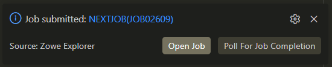

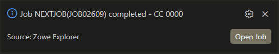

### Download data sets and USS files to the local filesystem

Zowe Explorer now supports being able to directly download data sets, data set members, USS files & USS directories to the local machine filesystem - with a multitude of basic and advanced options built into the download menus.

**Right click** on sequential data sets, partitioned data sets (to download all members), partitioned data set members, USS files, or USS directories and click on the respective `Download ...` option to select download options.

Please see the docs for much more detail on [downloading data sets](https://docs.zowe.org/stable/user-guide/ze-working-with-data-sets#downloading-a-data-set-to-a-local-file), downloading [USS files](https://docs.zowe.org/stable/user-guide/ze-working-with-uss-files#downloading-a-uss-file-to-a-local-file) or [USS directories](https://docs.zowe.org/stable/user-guide/ze-working-with-uss-files#downloading-a-uss-directory-to-a-local-directory).

Note as this is a brand new feature, only the `z/OSMF` profile type supports this functionality upon release. Expect other profile types to add their backend support over time.

### Filter data sets by name or by date created

Now the right click option on partitioned data sets and profile to filter data sets/data set members supports filtering by name or by date created. The filter by name supports wildcards and comma-separated names in the same way as the data set search.

Note that the filter only applies on the client side, so if pagination is enabled and active, each individual page is filtered and it may still require clicking through pages to get to the one with the filtered data sets or members.

### Favorites changes

#### Favorite VSAM data sets

VSAM data sets can now be favorited.

#### Favorite individual PDS members

The favorites tree now supports being able to favorite individual members of a partitioned data set.

When favoriting a data set member, the partitioned data set will still show in the favorites tree, but now only with the favorited data set member under it, rather than all members as before. When expanded, a tooltip will now show beside the data set name with the number of members that are favorited inside of it vs the total number of members the data set has.

The entire PDS can still be favorited with all members. When a member is removed from favorites, only it is removed, unless it is the only member in the PDS, in which case the entire PDS will be removed from favorites.

Several members may be favorited or unfavorited at once by doing a multi-selection.

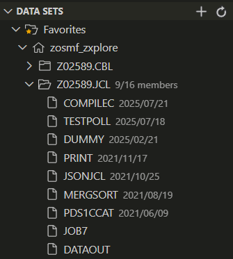

Note that when only a partial selection of PDS members are favorited, data set pagination is disabled on the PDS in the favorites tree.

### Accessibility improvements

Many issues have been addressed to allow screen readers to better navigate and use Zowe Explorer features.

### Smarter data set search filtering

Data set search is now even smarter because it supports comma-separated member names within a partitioned data set. For example, `MY.PDS(MEM1,TEST*)` will return `MY.PDS` with the member called `MEM1` and any members beginning with `TEST`.

### Setting to hide hidden USS files

Currently, hidden Unix files (those starting with a `.`) are always listed in the USS tree. There is now a setting **Zowe > Files: Show Hidden Files** that can be disabled to hide these files.

### Localization for release notes and changelogs

Text and alt text in the release notes and the changelogs are now localizable.

Localization is tied to the VS Code localization setting. If there are no localizations available for a string, it will fallback to English.

If you wish to make localization contributions to these or generally across the rest of Zowe Explorer, please reach out in the usual places.

---

## `3.4.0`

### VS Code engine support change

Updated minimum VS Code version from 1.79 to 1.90. We are dropping support for VS Code releases that bundle versions of Node.js no longer receiving security updates.

### Credential Manager Updates

#### Loading credential manager options

Added support for loading credential manager options from the imperative.json file. Added a `credentialManagerOptions` object in the JSON object in `imperative.json` to specify options for the current credential manager.

#### Windows custom persistence levels

Added support for custom persistence levels for Windows (persist option) to support the credential manager in less permissive environments. For more information on how to configure this option, refer to the ["Troubleshooting Zowe CLI credentials"](https://docs.zowe.org/stable/troubleshoot/cli/troubleshoot-cli-credentials/#secrets-sdk-persistence-level-for-windows) page on Zowe Docs.

### MVS data set enhancements

#### Copy across LPAR updates

Added support for copying data sets from multiple source LPARs at once in the cross-LPAR copy/paste functionality. Updated Zowe SDKs to version `8.28.0` to address an issue where copying a PDS member to a data set across LPARs failed. This occurred when the target PDS already contained members, but none matched the name of the PDS member being copied.

#### VSAM support updates

Added support to delete VSAM data sets via right-click action.

### Job enhancements

#### Get JCL encoding

Added support for `encoding` profile property when retrieving JCL with z/OSMF. For example, include `"encoding": "IBM-1147"` in the z/OSMF profile to view JCL with "IBM-1147" encoding via the right-click `Get JCL` job option.

#### Submit job with encoding

Added support for `jobEncoding` profile property when submitting jobs to z/OSMF. For example, include `"jobEncoding": "IBM-1147"` in the z/OSMF profile to submit jobs with "IBM-1147" encoding.

---

## `3.3.0`

### Release notes

Release notes for Zowe Explorer are now available in VS Code. Release notes are displayed when Zowe Explorer updates and can also be accessed from the command palette (`Ctrl` + `Shift` + `P`) by searching for `Zowe Explorer: Display Release Notes`. Disable automatic display of release notes when updating by unticking `Display release notes after an update` in this window or in the Zowe Explorer settings.

### Data sets table

Data sets can now be viewed in a table format, similar to the jobs table. The data sets table allows for easier filtering, sorting, and bulk actions on data sets and members.

- **Open the table:**
  - Right-click a filtered data sets profile, a data set, or a favorite, and select **Show as Table**.
  - Open the **Command Palette** and search for `Zowe Explorer: List Data Sets`, select a profile, and enter a search filter.

- **Features:**
  - Reorder, filter, sort, and choose visible columns
  - View members of a partitioned data set
  - Select multiple data sets or members for bulk open
  - Pin rows to keep them visible while scrolling
- **Row actions:** Right-click a data set to:
  - Open the data set
  - Display the data set in the **DATA SETS** tree
  - Pin or unpin the row

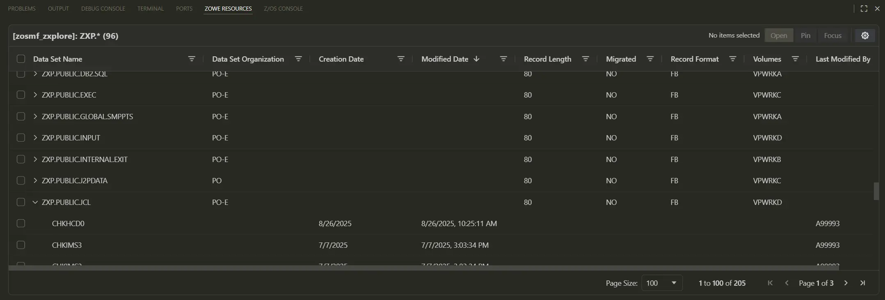

### Open selected data set

Select text in the editor, right-click, and choose **Open Selected Data Set**. If the selected text is a valid data set name, it opens in a new editor tab or focus onto an existing tab if already open. If the selected text is a valid partitioned data set, it opens in the **DATA SETS** tree. This is equivalent to the `ZOOM` command in ISPF.

### Upload with encoding

Right-click on a directory or partitioned data set in the **USS** or **DATA SETS** tree and select **Upload with Encoding...** to choose a character encoding for the uploaded files.

### Poll active jobs

Active jobs in the **JOBS** tree can now be set to poll for job completion. Right-click on a filtered jobs profile, select **Start Polling Active Jobs**, and enter the desired poll interval. The default poll interval can be set in the Zowe Explorer settings under **Zowe > Jobs > Poll Interval**. The minimum interval is 1000ms.

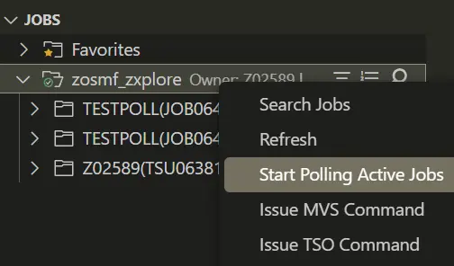

Active jobs in the filtered profile automatically refresh at the specified interval and any new jobs matching the filter automatically appear. When a job completes, it shows a notification message with the job name and return code.

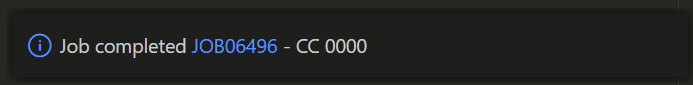

When all jobs have completed, polling automatically stops. Alternatively, to stop polling, right-click the profile again and select **Stop Polling Active Jobs**.

---

## `3.2.0`

### Job spool pagination

Large job spool files now load faster by displaying a `Load more…` button at the bottom of the spool file to fetch additional lines as needed. For active jobs, use this button to retrieve new output without refreshing the **JOBS** tree. It is recommended to use the default keyboard shortcut `Ctrl` + `L` to quickly load more lines. The number of lines per page and the toggle for pagination can be configured in the settings under **Zowe > Jobs > Paginate**. The default is 100 lines per page.

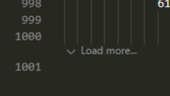

### Data set tree pagination

The Data Sets tree and any data sets with many members now display `<- Previous page` and `-> Next page` navigation buttons to page through members. Only a subset of members is loaded at a time, allowing for large filters and data sets to load members faster. The number of members per page is configurable in the settings under **Zowe > Ds > Paginate**. The default is 100 members per page.

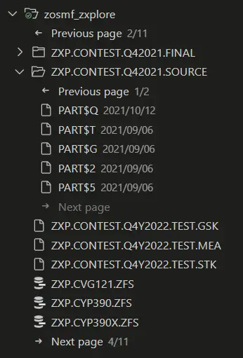

**Note:** Sorting is only applied within each page, while the overall member list is fetched by alphabetical, ascending order.

### Default sort order

The default sort order of every data set or job can now be changed. For example, to always open a data set to see the most recently edited members, set the default sort order to be by descending, date modified. The following settings are available:

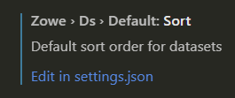
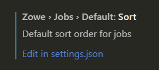

Click on `Edit in settings.json` to enter in desired values in the file. Specify the method and direction from the options provided by IntelliSense. For example:

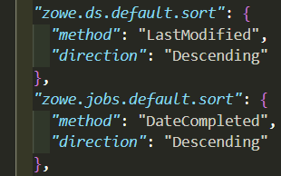

### Case sensitive and regex searching

Data set searches now support case sensitivity and regular expressions. Enable these options in the `Search PDS members` Quick Pick dialog.

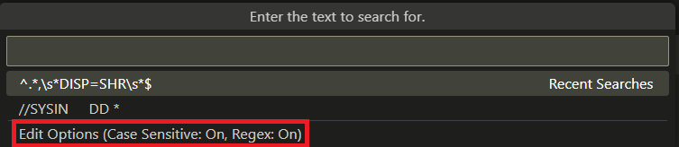
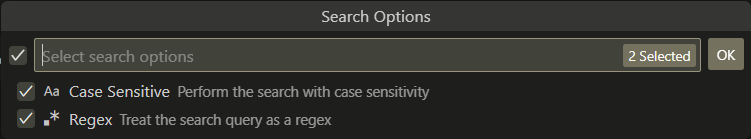

### Advanced data set copy and paste

Data sets and members can now be copied and pasted within or across LPARs. Drag and drop is also supported for moving items between locations. Permission and attribute edge cases are handled with clear error messages.

### Improved USS filtering

The **USS** tree can now be filtered by any selected directory. Right-click a directory and select `Search by directory` to filter. Use the `Go Up One Directory` button to quickly adjust the filter to the parent directory.

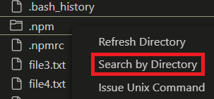
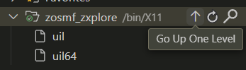

### Profile info hover

Hovering over a data set, USS, or jobs profile now displays detailed connection information.

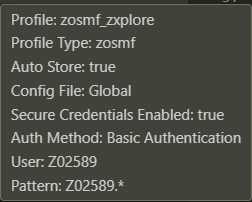

---

## `3.1.0`

### Jobs table

The jobs table is a panel that allows viewing filtered jobs more clearly and for performing bulk actions on jobs.

- **Open the table:** Right-click a filtered jobs profile and select **Show as Table**.

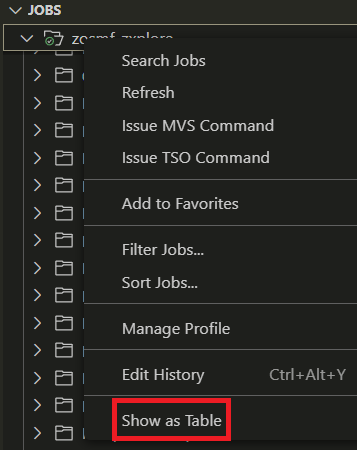

- **Features:** Reorder columns, filter and sort on columns, choose visible columns, and select multiple jobs for bulk cancel, delete, or download.
- **Row actions:** Right-click a job to:
  - View JCL (opens as an unsaved editor file)
  - Open the job in the Jobs tree
  - Copy job info as JSON

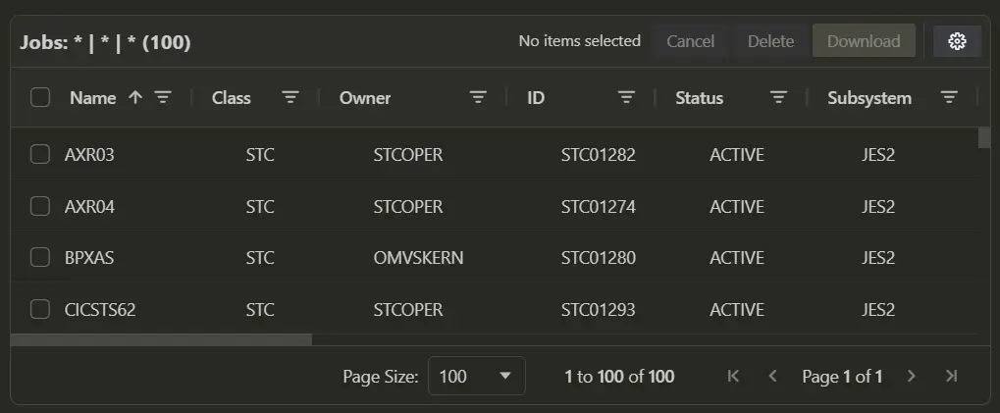

### Search data sets

Data sets can now be searched for a string, similar to ISPF's `SRCHFOR`.

- **Search options:**
  - Right-click a profile: **Search filtered data sets**
  - Right-click a PDS: **Search PDS members**
  - Also available for a PDS in the Favorites tree

- **How it works:**
  - Enter search string in the input field at the top.
  - If searching more than 50 members, a prompt displays to confirm or cancel.
  - Progress is shown in the status bar.
  - Results appear in the `Zowe Resources` panel, where files can be bulk opened.

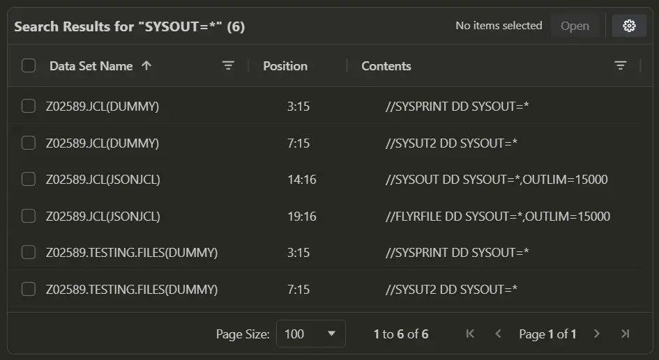

### Integrated terminal

The integrated terminal connects to the mainframe via SSH for MVS, TSO, or USS commands. Multiple sessions are supported. Currently disabled by default as further development is actively ongoing.

- **Enable:** Go to Zowe Explorer settings and check **Use Integrated Terminals**.
- **Open:** Right-click a profile in Data Sets, USS, or Jobs tree and select an **Issue x Command** option.
- **Behavior:** Each command opens a dedicated terminal panel (for example, only MVS commands in the MVS terminal).

### Auto-detect global team configuration

Zowe Explorer now auto-detects the global team configuration, regardless of the location of the currently opened VS Code working directory.

### Add to workspace

Add data sets, USS profiles, or USS directories to a VS Code workspace to group resources from different locations. Right-click a data set, USS profile, or USS directory and select **Add to workspace**.

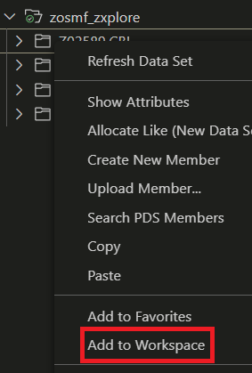

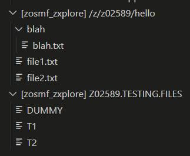

### Edit history

Edit history allows viewing, deleting, or adding a profile's search/filter history for data sets, USS, and jobs. Right-click a profile and select **Edit History**.

---

## `` <!-- KEEP THIS HERE AS IT MARKS END OF FILE -->
