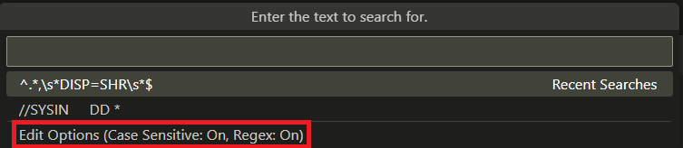

## `3.2.0`

### Job spool pagination

Large job spool files now load faster by displaying a `Load more…` button at the bottom of the spool file to fetch additional lines as needed. For active jobs, use this button to retrieve new output without refreshing the Jobs tree. It is recommended to use the default keyboard shortcut `Ctrl` + `L` to quickly load more lines. The number of lines per page and the toggle for pagination can be configured in the settings under `Zowe > Jobs > Paginate`. The default is 100 lines per page.

### Data set tree pagination

The Data Sets tree and any data sets with many members now display `<- Previous page` and `-> Next page` navigation buttons to page through members. Only a subset of members is loaded at a time, allowing for large filters and data sets to load members faster. The number of members per page is configurable in the settings under `Zowe > Ds > Paginate`. The default is 100 members per page.

**Note:** Sorting is only applied within each page, while the overall member list is fetched by alphabetical, ascending order.

### Default sort order

The default sort order of every data set or job can now be changed. For example, to always open a data set to see the most recently edited members, set the default sort order to be by descending, date modified. The following settings are available:

Click on `Edit in settings.json` to enter in desired values in the file. Specify the method and direction from the options provided by IntelliSense. For example:

### Case sensitive and regex searching

Data set searches now support case sensitivity and regular expressions. Enable these options in the `Search PDS members` Quick Pick dialog.

### Advanced data set copy and paste

Data sets and members can now be copied and pasted within or across LPARs. Drag and drop is also supported for moving items between locations. Permission and attribute edge cases are handled with clear error messages.

### Improved USS filtering

The USS tree can now be filtered by any selected directory. Right-click a directory and select `Search by directory` to filter. Use the `Go Up One Directory` button to quickly adjust the filter to the parent directory.

### Profile info hover

Hovering over a data set, USS, or jobs profile now displays detailed connection information.

## `3.1.0`

### Jobs table

The jobs table is a panel that allows viewing filtered jobs more clearly and for performing bulk actions on jobs.

- **Open the table:** Right-click a filtered jobs profile and select **Show as Table**.

- **Features:** Reorder columns, filter and sort on columns, choose visible columns, and select multiple jobs for bulk cancel, delete, or download.
- **Row actions:** Right-click a job to:
  - View JCL (opens as an unsaved editor file)
  - Open the job in the Jobs tree
  - Copy job info as JSON

### Search data sets

Data sets can now be searched for a string, similar to ISPF's `SRCHFOR`.

- **Search options:**

  - Right-click a profile: **Search filtered data sets**
  - Right-click a PDS: **Search PDS members**
  - Also available for a PDS in the Favorites tree

- **How it works:**
  - Enter search string in the input field at the top.
  - If searching more than 50 members, a prompt displays to confirm or cancel.
  - Progress is shown in the status bar.
  - Results appear in the `Zowe Resources` panel, where files can be bulk opened.

### Integrated terminal

The integrated terminal connects to the mainframe via SSH for MVS, TSO, or USS commands. Multiple sessions are supported. Currently  disabled by default as further development is actively ongoing.

- **Enable:** Go to Zowe Explorer settings and check **Use Integrated Terminals**.
- **Open:** Right-click a profile in Data Sets, USS, or Jobs and select an **Issue x Command** option.
- **Behavior:** Each command opens a dedicated terminal panel (for example, only MVS commands in the MVS terminal).

### Auto-detect global team configuration

Zowe Explorer now auto-detects the global team configuration, regardless of the location of the currently opened VS Code working directory.

### Add to workspace

Add data sets, USS profiles, or USS directories to a VS Code workspace to group resources from different locations. Right-click a data set, USS profile, or USS directory and select **Add to workspace**.

### Edit history

Edit history allows viewing, deleting, or adding a profile's search/filter history for data sets, USS, and jobs. Right-click a profile and select **Edit History**.

## `` <!-- KEEP THIS HERE AS IT MARKS END OF FILE -->
