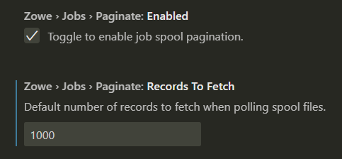
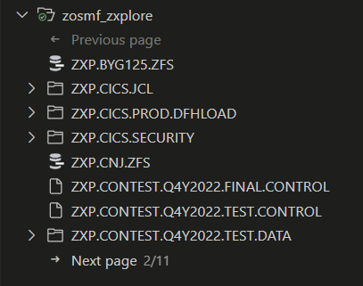
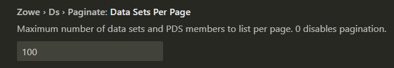
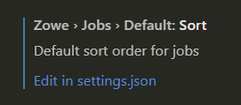
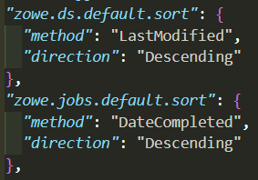
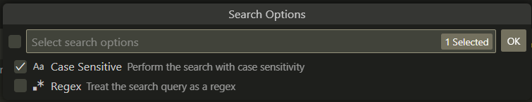

## `3.2.0`

### Job spool pagination

When you open a job spool file, the spool should load almost instantly and there will be a `Load more…` button inside the file at the bottom to load more lines of spool. When you click the button, another bunch of lines will load in.

If the job is actively running and printing new lines to spool, you can click the `Load more…` button to fetch more spool into the file, rather than clicking the refresh button.

It is recommended to use the keybinding `Ctrl + L` to quickly load new lines.

In the Zowe settings, you can either change the number of lines per pagination, or disable the pagination feature entirely. I set mine to 1000 lines:

### Data set tree pagination

When you open a PDS with more than 100 members, you will see `<- Previous page` and `Next page ->` buttons that allow you to page through the PDS 100 members at a time.

This is a server sided operation meaning that opening massive data sets will no longer take a while as it will only fetch 100 members at a time (the example below has the setting on 10 members for demo purposes):

You can change the number of members to list per page, or set it to 0 to disable it:

Also note that since the pagination is server sided, the sort order you have set is applied **after** the pagination, meaning that only each page is sorted, while the whole PDS is fetched in ascending, alphabetical order regardless of your sort setting.

### Default sort order

You can now change the default sort order of every data set or job. For example, if you always want to open a PDS to see the latest members you have been editing, you can set the default sort order to be by descending, date modified. This means you don’t have to change it every single time you open the PDS.

Go to the settings and find this:

Or this one for jobs:

Click on `Edit in settings.json` and it will open the file with a place to put in your values. Simple specify method and direction you want - VS Code will provide you with all possible values as you type. For example these are my settings:

### Case sensitive & regex searching

When you search data sets, you can now select if you want the search to be case sensitive and/or using regex. To change the setting, simply open the `Search PDS members` quick pick, then select the option at the bottom under your history:

Then check the boxes for the options you want to enable:

And click OK. Then it will go back to the previous page and allow you to submit your search query.

### Advanced data set copy & paste

You can now copy and paste data sets within and between different LPARs.

You can also now drag and drop data sets and members between each other and different LPARs, which will move that item to the dropped location.

Edge cases surrounding permissions, data set attributes and such are handled with appropriate error messages so you know what’s going wrong if something does.

### Better USS filtering

You can now filter the USS tree on a selected directory.

Right click on the directory you want to filter on and select `Search by directory`:

You can also "cd up" into the parent directory on your selected path filter to save a bit of manual time. Simply click the `Go Up One Directory` up arrow on the filter bar:

### Profile info hover

You can now view details about a data set, USS or jobs profile by simply hovering over it.

